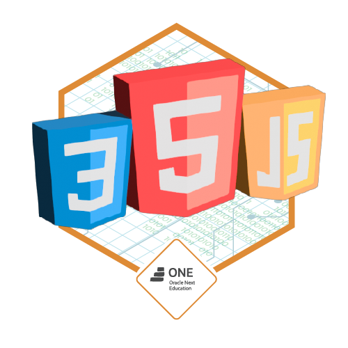
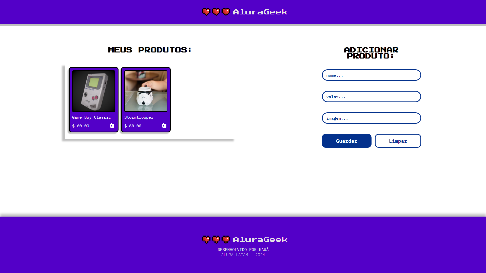

## Challenge Portfólio

<p align="center">
  
</p>

## Descrição

Este projeto foi proposto pelo programa ONE e consiste em um desafio front-end para criar cards que consomem uma API Fake utilizando JSON Server. A aplicação foi desenvolvida com HTML, SCSS e JavaScript.

## Screenshot da Aplicação

<p align="center">
  
</p>

### Requisitos

- Git
- Node.js
- Visual Studio Code

### Instalação

1. Clone o repositório:

   ```bash
   git clone https://github.com/kauatwn/alura-geek.git
   ```

2. Instale as dependências:

   ```bash
   npm install
   ```

3. Instale a extensão **Live Sass Compiler** oferecida por Glenn Marks.

4. Instale a extensão **Live Server** oferecida por Ritwick Dey.

5. Inicie o JSON Server:

   ```bash
   npm start
   ```

6. No Visual Studio Code, clique nos botões `Watch Sass` e `Go Live` no canto inferior direito.

### Explicações Adicionais

- **Watch Sass**: Compila automaticamente o SCSS e aplica as estilizações sempre que houver alterações nos arquivos SCSS.
- **Go Live**: Inicia um servidor local e abre a aplicação no navegador, permitindo ver as alterações em tempo real.
